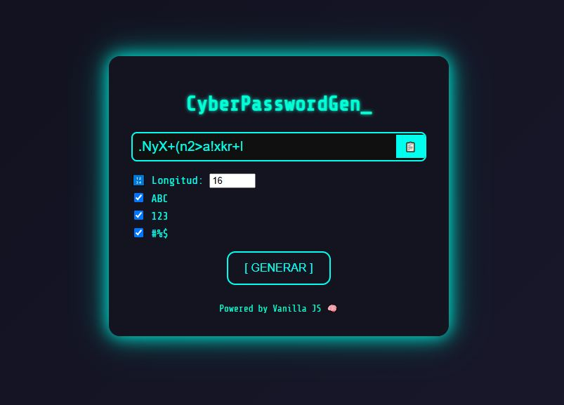

# 🔐 Generador de Contraseñas Seguras

Generador de contraseñas aleatorias con opciones configurables.  
Hecho con HTML, CSS y JavaScript puro (Vanilla JS).

## 🎯 Funcionalidades

- Configura la longitud de la contraseña
- Elige si incluir:
  - Mayúsculas
  - Números
  - Símbolos
- Copia la contraseña con un solo clic

## 🖥️ Cómo usar

1. Abre `index.html` en tu navegador.
2. Ajusta las opciones.
3. Haz clic en "Generar Contraseña".
4. Copia al portapapeles con el botón 📋.

## 📸 Vista previa

---

¡Ideal para mejorar seguridad en tus cuentas o probar generadores JS!
# cyber-password-generator
Generador de contraseñas seguras con estilo cyberpunk. HTML, CSS y JavaScript puro.

## 🔐 Por qué usar este generador

Este generador es útil para crear contraseñas aleatorias y seguras que puedas copiar rápidamente.  
Ideal para programadores, diseñadores y usuarios que cuidan su ciberseguridad.
